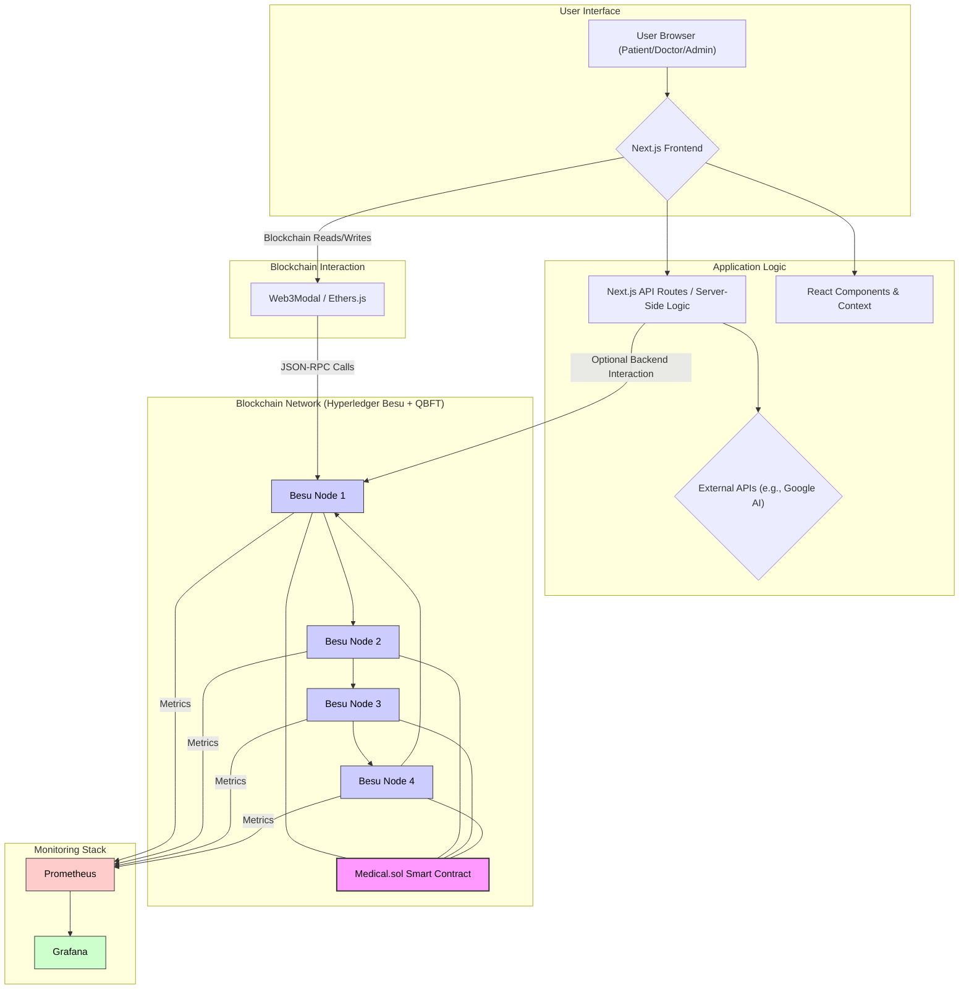
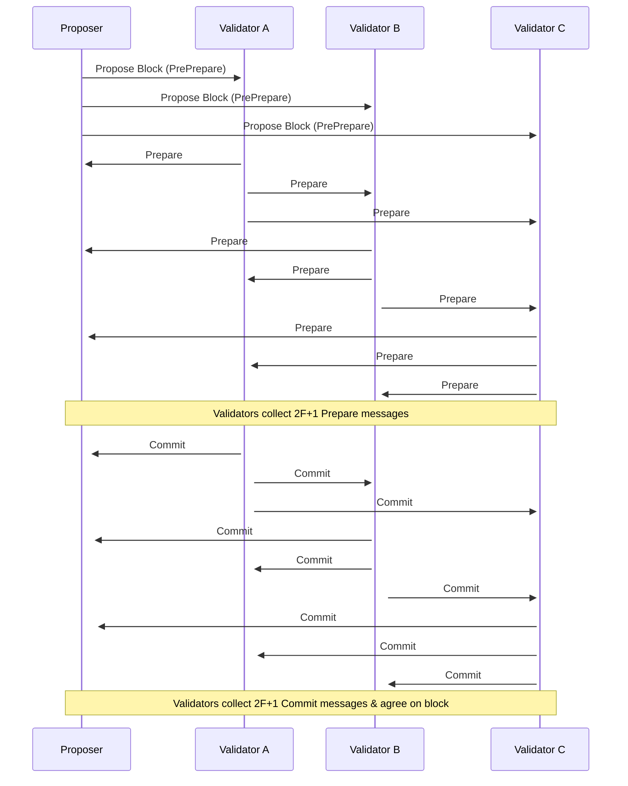
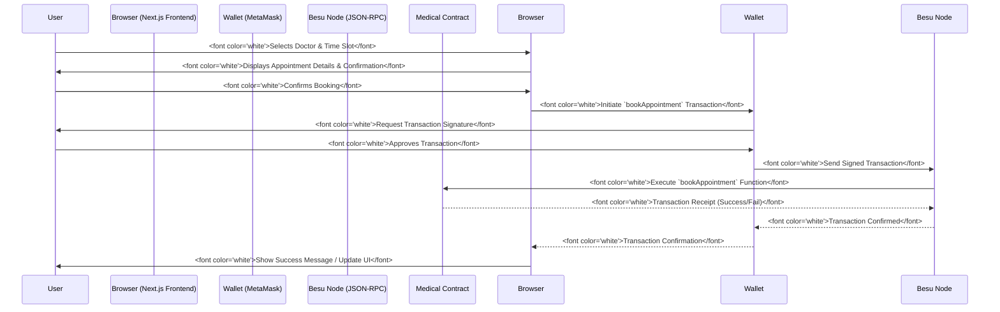
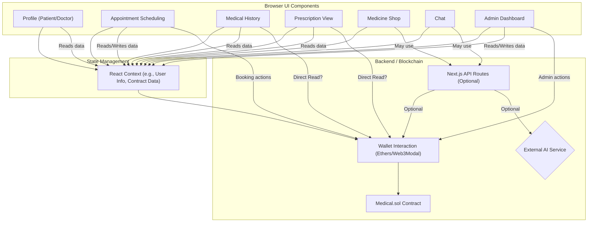
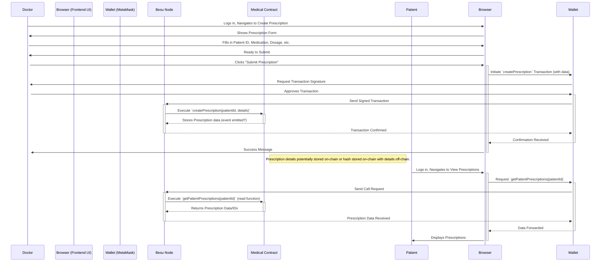
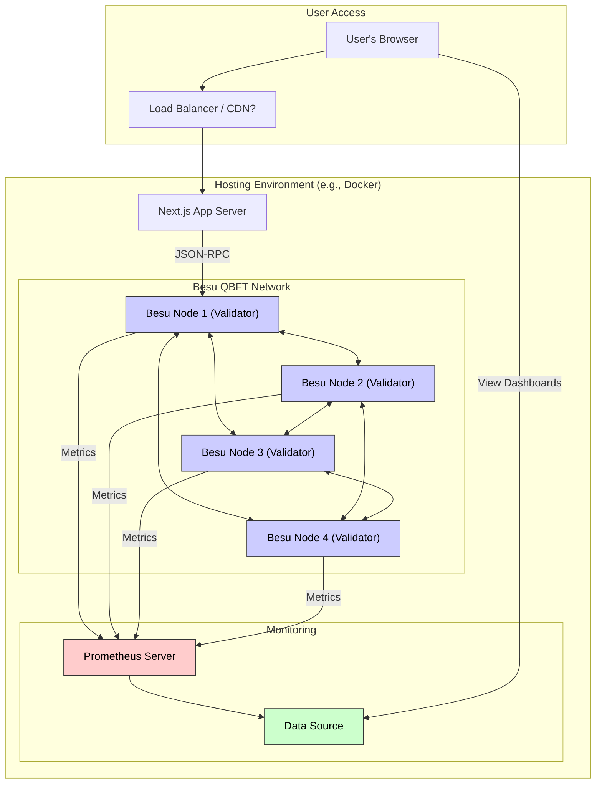
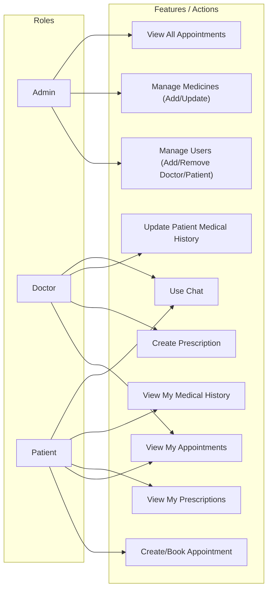
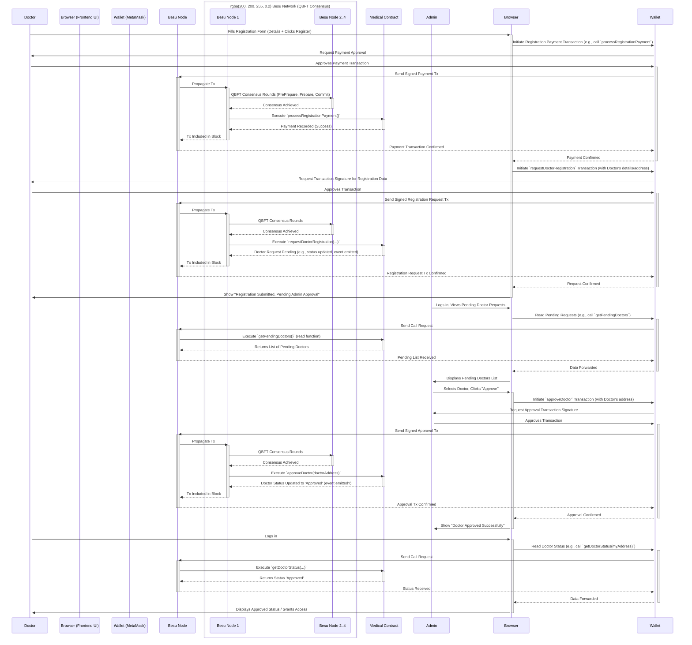

# HealthCare dApp

A decentralized application (dApp) built with Next.js and Solidity for managing healthcare-related functionalities on the blockchain.

## Features

Based on the project structure (`Components/` directory), potential features include:

- **Admin Dashboard:** Management interface for administrators.
  - Medicine Management (Add/Update)
  - Appointment Overview
  - User Management (AppUser, Doctor, Patient)
  - Admin Profile Management
- **User Authentication:** Secure login and registration for different user roles.
- **Appointment Scheduling:** Booking and managing appointments with doctors.
- **Profiles:** Detailed profiles for Patients, Doctors, and Staff.
- **Medical History:** Tracking patient medical records securely (potentially on-chain).
- **Prescriptions:** Managing and viewing prescriptions.
- **AI Integration:** Features leveraging AI capabilities (details depend on implementation in `Components/Global/AI`).
- **Chat Functionality:** Real-time communication features.
- **Medicine Shop/Orders:** Browsing and ordering medicines.
- **Notifications:** In-app notifications system.
- **Blockchain Interaction:** Leveraging blockchain for data integrity, transparency, or specific workflows (e.g., using the `Medical.sol` contract).

## Tech Stack

- **Frontend:**
  - Next.js (v13.4.13)
  - React (v18.2.0)
  - Ethers.js (v5.7.2)
  - Web3Modal
  - Axios
  - React Icons, React Hot Toast, React Dropzone
  - Google Generative AI SDK
  - CSS/SCSS (Structure suggests usage in `public/css`, `public/scss`)
- **Blockchain:**
  - Solidity (v0.8.17)
  - Hardhat (v2.12.0)
  - Hyperledger Besu (Private Network with QBFT consensus)
  - Ethereum Virtual Machine (EVM)
- **Development Tools:**
  - Node.js
  - npm/yarn
  - Docker (likely required for running the Besu QBFT network and Monitoring stack)
- **Monitoring:**
  - Prometheus
  - Grafana (with custom dashboard defined in `dashboard.json`)

## Project Structure

```
├── Components/         # React components organized by feature/scope
├── Context/            # React context providers for state management
├── contracts/          # Solidity smart contracts (e.g., Medical.sol)
├── pages/              # Next.js pages and API routes
├── public/             # Static assets (images, css, js vendor libs)
├── scripts/            # Deployment or utility scripts (likely for Hardhat)
├── styles/             # Global styles or SCSS partials
├── QBFT-Network/       # Configuration/data for a local QBFT Besu network setup
├── artifacts/          # Compiled contract artifacts (generated by Hardhat)
├── cache/              # Hardhat cache
├── prometheus-config.yml # Prometheus configuration
├── dashboard.json      # Grafana dashboard configuration
├── .env.local          # Local environment variables (GITIGNORED)
├── .env.sample         # Sample environment variables file
├── hardhat.config.js   # Hardhat configuration
├── next.config.js      # Next.js configuration
├── package.json        # Project dependencies and scripts
└── README.md           # This file
```

## Architecture Diagram



## QBFT Consensus Flow (Simplified)

This diagram shows a simplified view of the message exchange between validator nodes during a QBFT consensus round to agree on a new block.



## Example Application Flow (Appointment Booking)

This diagram illustrates the sequence of interactions when a user books an appointment.



## Frontend Component Interaction

This diagram shows potential interactions between major UI components, context, and backend/blockchain services.



## Detailed Data Flow (Example: Prescription Creation)

Illustrates how a prescription might be created and stored.



## Deployment Architecture

Shows the likely runtime deployment setup.



## User Roles and Permissions (Conceptual)

Maps user roles to potential application/contract capabilities.



## Smart Contract State Diagram (Hypothetical Example: Appointment)

**Note:** This is a _hypothetical_ state diagram for an Appointment entity within `Medical.sol`, as the actual implementation is not known.

```mermaid
stateDiagram-v2
    [*] --> Scheduled: bookAppointment()
    Scheduled --> Confirmed: confirmAppointment() [by Doctor/Admin]
    Scheduled --> Cancelled: cancelAppointment() [by Patient/Doctor/Admin]
    Confirmed --> Completed: markComplete() [by Doctor]
    Confirmed --> Cancelled_Confirmed "Cancelled (by Doctor/Admin)": cancelAppointment()
    Cancelled --> [*]
    Cancelled_Confirmed --> [*]
    Completed --> [*]
```

## Detailed Interaction Flow (Doctor Registration & Approval)

This diagram details the sequence for a doctor registering, including payment (hypothetical), admin approval, and the underlying blockchain interactions with QBFT consensus represented.



## Getting Started

### Prerequisites

- Node.js (v16 or later recommended)
- npm or yarn
- Git
- MetaMask browser extension (or other web3 wallet)
- Docker (likely required for running the Besu QBFT network and Monitoring stack)

### Installation & Setup

1.  **Clone the repository:**

    ```bash
    git clone <repository-url>
    cd healthcare-dapp
    ```

2.  **Install dependencies:**

    ```bash
    npm install
    # or
    yarn install
    ```

3.  **Set up environment variables:**

    - Copy the sample environment file:
      ```powershell
      copy .env.sample .env.local
      ```
    - Fill in the required values in `.env.local`. This will likely include:
      - RPC URLs for blockchain networks (e.g., `NEXT_PUBLIC_RPC_URL` if deploying to a testnet/mainnet, or your local Besu RPC)
      - Private keys for deployment (ensure these are kept secure and are intended for development/testing, like `NEXT_PUBLIC_PRIVATE_KEY` seen in `hardhat.config.js`)
      - API keys (e.g., for Google Generative AI)

4.  **Blockchain Setup:**

- **Network & Monitoring:**
  - The primary setup involves running the Hyperledger Besu network configured in the `QBFT-Network/` directory. This setup likely uses Docker Compose or similar tools.
  - Follow the specific instructions for initializing and running the Besu nodes, Prometheus (`prometheus-config.yml`), and Grafana (`dashboard.json`). The `hardhat.config.js` is configured to connect to the Besu network's RPC endpoint (e.g., `http://localhost:8545`).
- **Compile Contracts:**
  ```bash
  npx hardhat compile
  ```
- **Alternative (Simple Testing): Hardhat Network:** For quick contract testing without the full Besu setup, you can use the built-in Hardhat network:
  ```bash
  npx hardhat node
  ```
  _Note: This will not interact with the Besu network or its state._
- **Deploy Contracts:**

  - You'll likely need a deployment script in the `scripts/` directory (e.g., `deploy.js`).
  - Run the deployment script, targeting your chosen network:

    ```bash
    # Example for Hardhat local network (if using for simple testing)
    npx hardhat run scripts/deploy.js --network localhost
    ```

  - After deployment, update your `.env.local` or frontend configuration with the deployed contract address(es).

### Running the Application

1.  **Start the development server:**

    ```bash
    npm run dev
    # or
    yarn dev
    ```

    This will start the Next.js application, typically on `http://localhost:4000` (as specified in `package.json`).

2.  **Open your browser:** Navigate to `http://localhost:4000`.

3.  **Connect Wallet:** Use the application's UI (likely involving Web3Modal) to connect your MetaMask wallet. Ensure MetaMask is connected to the same network where the contracts were deployed (e.g., Localhost 8545 for the Hardhat node or your Besu network).

4.  **(Optional) Access Monitoring:**

- Access Grafana (usually on `http://localhost:3000`) to view the blockchain network dashboard configured via `dashboard.json`.
- Access Prometheus (usually on `http://localhost:9090`) to view raw metrics.

## Scripts

- `npm run dev`: Starts the Next.js development server on port 4000.
- `npm run build`: Builds the Next.js application for production.
- `npm run start`: Starts the production Next.js server (requires `build` first).
- `npm run lint`: Lints the codebase using Next.js's built-in ESLint configuration.
- `npx hardhat compile`: Compiles Solidity contracts.
- `npx hardhat node`: Runs a local Hardhat Ethereum node.
- `npx hardhat test`: Runs contract tests (if any exist in `test/`).
- `npx hardhat run <script>`: Executes a Hardhat script.

## Contributing

(Optional: Add contribution guidelines if this is an open-source project).

## License

(Check `package.json` or add a `LICENSE` file - currently assumes private use based on `package.json`).
